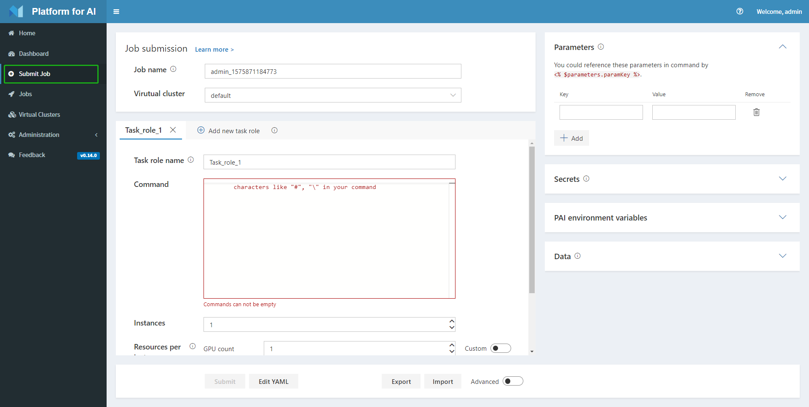
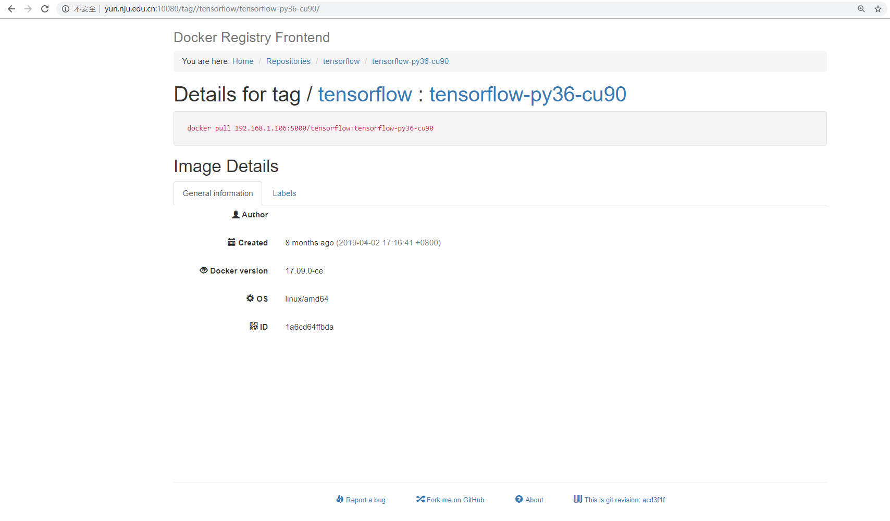
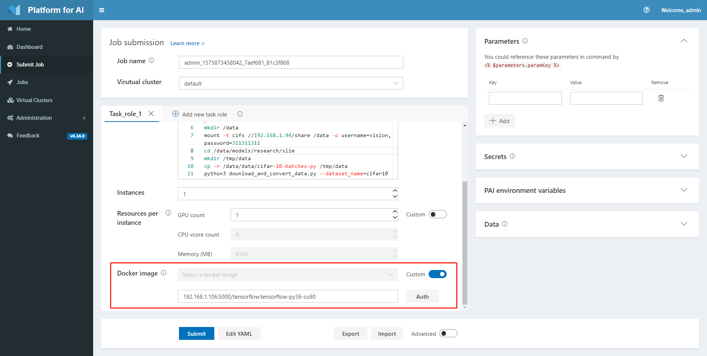
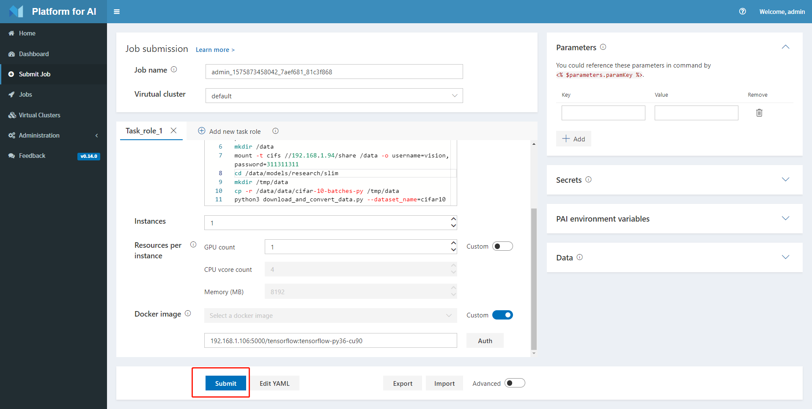
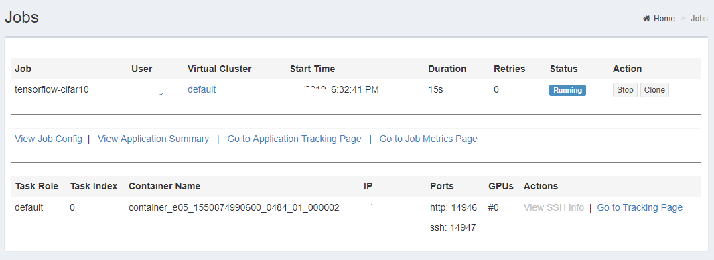

# 在 OpenPAI 上训练模型

- 在 OpenPAI 上训练模型
  - 提交 hello-world Job
  - 理解 Job
    - 了解 hello-world Job
    - 传入/传出文件
    - Job 流程

本文档适用于 OpenPAI 的新用户。 其介绍了在 OpenPAI 上训练模型或执行其它类型命令的必需知识。

在开始之前，确保已经有了 OpenPAI 集群的 IP 地址或域名，以及它的用户名、密码。 

## 提交 hello-world Job

**Job** 在 OpenPAI 中定义了在指定的环境中如何执行命令。 Job 可以是模型训练，其它用途的命令，或者分布在多台服务器上。

本节介绍了如何提交一个非常简单的 Job，这就像在学习编程语言时，从 hello-world 示例开始一样。 此示例使用 TensorFlow 在 CIFAR-10 数据集上训练模型。 其从互联网下载数据和代码，且没有将训练完的模型复制出来。 通过此示例可初步了解 OpenPAI。 接下来的章节会介绍更多内容，以便于提交真正实用的 Job。

**注意**， Web 界面是提交 Job 的方法之一。 它学起来非常简单，但却不是最高效的提交和管理 Job 的方法。 推荐使用 [OpenPAI VS Code Client](../../../contrib/pai_vscode/VSCodeExt_zh_CN.md)，来获得最好的体验。

1. 浏览至 OpenPAI 的 Web 界面。 可从 OpenPAI 管理员那里获取 IP 地址或域名。 在登录页面中，点击 *sign in*，输入用户名、密码。

  之后，OpenPAI 会显示如下的 Job 列表。

  

2. 单击左边的的 **Submit Job** 并转到此页面。

  

3. 选中 **Command**窗口 。 粘贴下面的内容。

```bash
wget https://tuna.moe/oh-my-tuna/oh-my-tuna.py
yes y | python oh-my-tuna.py --global
apt update
apt install -y cifs-utils python3-contextlib2
pip install -i https://pypi.tuna.tsinghua.edu.cn/simple pillow
mkdir /data
mount -t cifs //192.168.1.94/share /data -o username=vision,password=311311311
cd /data/models/research/slim
mkdir /tmp/data
cp -r /data/data/cifar-10-batches-py /tmp/data
python3 download_and_convert_data.py --dataset_name=cifar10 --dataset_dir=/tmp/data
python3 train_image_classifier.py --dataset_name=cifar10 --dataset_dir=/tmp/data --train_dir=/tmp/output --max_number_of_steps=1000
cp -rf /tmp/output /data/models/output
```

4. 选择Docker image，点击Custom，访问 实验室私有docker仓库（详细私有docker仓库使用说明参考[使用说明](docker-registry.md)），选择合适docker镜像，填入Docker images。






4. 然后点击 **Submit** 按钮将 Job 提交到 OpenPAI 平台。

  

5. 提交后，页面重定向到作业列表，提交的作业在列表中为 **Waiting** 状态。 单击左边的 **Jobs** 也可以到达此页面。

  

6. 单击 Job 名称查看详细信息。 开始运行后，Job 状态会变为 *Running*，并且会在下面显示分配给 Task Role 的 IP 地址。 除此之外，还有更多的信息及操作，如状态、查看日志等。

  

## 理解 Job

本届介绍了更多关于 Job 的知识，以便于编写自己的 Job 配置。

### 了解 hello-world Job

**Job 配置**是一个发送到 OpenPAI 的 JSON 文件。 hello-world Job 的配置包含了以下必需的关键字段。

JSON 文件中的字段有两个级别。 顶级节点是此 Job 的共享信息，包括 Job 名称，Docker 映像， Task Role 等等。 第二级是 taskRoles，是一个数组，其中每一项包含一个命令及其运行环境。

以下是 Job 配置的必需字段。

- **jobName** 是当前 Job 的名称。 在每个用户账号中，其必需是唯一的。 有意义的名称有助于管理 Job。

- **image**

  [Docker](https://www.docker.com/why-docker) 是在服务器上提供虚拟环境的常用技术。 OpenPAI 用 Docker 来提供一致、干净的环境。 通过 Docker，OpenPAI 可以在一台服务器上同时服务多个资源请求。

  **image** 字段是 Docker 映像的标识，其中已经安装好了定制的 Python 和系统的组件包。

  如果没有找到合适的 Docker 映像，可构建 Docker 映像并push到实验室私有仓库，能很容易的定制一个 Docker 映像。

  注意，如果 Docker 映像没有包括 *openssh-server* 和 *curl* 包，则无法使用 OpenPAI 的 SSH 功能。 如果需要 SSH 功能，可在已有的 Docker 映像上构造一个包含 *openssh-server* 和 *curl* 的新 Docker 映像。

- **taskRoles** 定义了 Job 中的不同角色。

  对于单机运行的 Job，在 taskRoles 中只有一个角色。

  对于分布式的 Job，taskRoles 中可能会有多个角色。 例如，在使用 TensorFlow 来运行分布式 Job 时，需要两个角色，包括参数服务器和工作节点。 相应的在 Job 配置中需要两个任务角色。

- **taskRoles/name** 是任务角色的名称，还会被用于分布式 Job 的环境变量中。

- **taskRoles/taskNumber** 是任务角色的实例数量。 在单服务器 Job 中，其为 1。 在分布式 Job 中，根据任务角色需要多少个实例来定。 例如，其在 TensorFlow 的工作阶段角色中为 8。 这表示 worker 角色会被实例化出 8 个 Docker 容器。

- **taskRoles/cpuNumber**，**taskRoles/memoryMB**，**taskRoles/gpuNumber** 非常容易理解。 它们指定了相应的硬件资源，包括 CPU 核数量，内存（MB），以及 GPU 数量。

- **taskRoles/command** 是此任务角色要运行的命令。 可以是多个命令，像在终端中一样，通过 `&&` 组合到一起。 例如，在 hello-world Job 中，命令会从 GitHub 中克隆代码，下载数据，然后执行训练过程。

  像 hello-world Job 一样，用户需要构造命令来获取代码、数据，并开始执行。

### 传入/传出文件

大多数模型训练以及其它类型的 Job 都需要在运行环境内外间传输文件。 这些文件包括数据集、代码、脚本、训练好的模型等等。

OpenPAI 会管理计算资源，但不会管理持久化的存储资源。 [如何使用存储]( https://github.com/microsoft/pai/blob/master/docs/zh_CN/user/storage.md )可帮助 OpenPAI 用户来理解并使用存储。

最好与 OpenPAI 集群的管理员确认如何传输文件，他们可能已经选出了最合适的方法和示例。

### Job 流程

Job 配置准备好后，下一步则需要将其提交到 OpenPAI。 。

注意，WEB 界面和 Visual Studio Code Client 都通过 [RESTful API](../rest-server/API.md) 来访问 OpenPAI。 可使用 RESTful API 来定制客户端体验。

收到 Job 配置后， OpenPAI 按以下步骤处理。

1. 等待分配资源。 OpenPAI 会等待分配到足够的资源，包括 CPU，内存和 GPU。 如果资源足够，Job 会很快开始。 如果资源不够，Job 会进入队列，并等待前面的 Job 结束后释放资源。

2. 初始化 Docker 容器。 如果指定的 Docker 映像不在本地， OpenPAI 会拉取它。 随后，OpenPAI 会初始化 Docker 容器。

3. 运行配置中的命令。 在命令执行过程中，OpenPAI 会近实时的输出 stdout 和 stderr。 还可通过一些指标来监控工作负载。

4. 结束 Job。 命令完成后，OpenPAI 会用最后的退出代码作为信号来决定 Job 是否成功结束。 0 表示成功，其它值表示失败。 随后，OpenPAI 会回收资源，以便运行下一个 Job。

当 Job 提交到 OpenPAI 后， Job 会从 waiting，切换到 running，然后是 succeeded 或 failed。 如果 Job 被用户或系统中断了，状态也可能显示为 stopped。
